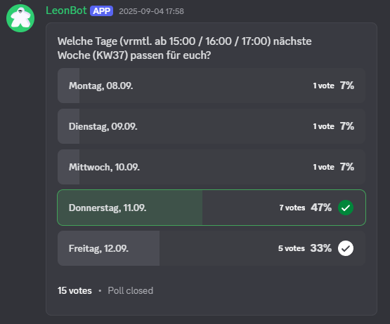
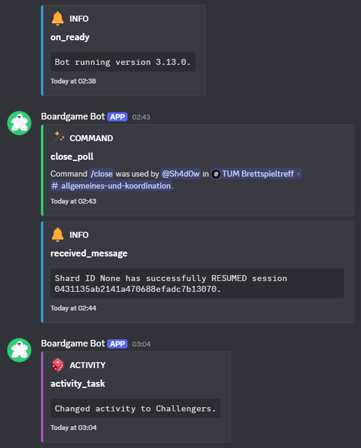

# Boardgame Bot

A discord bot for a board game meetup. Its main functionality is the `/poll` command, which
creates a poll to decide on the day on which to meet the next week. The command adds the dates of
the days of the week (and possible holidays) as poll options.




## Other commands

### Slash Commands
- `/message`: Send a message as the bot.

### Message Commands
- `/react`: React to a message as the bot. Copies the reaction(s) of the user who used the command.
- `/respond`: Respond to a message as the bot.
- `/delete`: Delete a bot message.
- `/close`: Close a bot poll.

### User Commands
- `/modview`: Get (most) of the information the Mod View would show to compensate for its absence
on the mobile app.


## Other features

### Reactions
Reactions will automatically be added if certain phrases are found in a message. These phrases and
reactions are specified in `config.json`.

### Activity
The bot will randomly choose a board game from `config.json` every 30 minutes and set it as its
game activity.

### Logging
The bot logs to the console, a log file, and a discord channel (specified in the
`.env` file).




## Some warnings

This bot is built for a very specific purpose and has features you will not need. If you are—for
whatever reason—considering using this bot on your on server, I would strongly advise against it.
This is whole instruction only exists so I can reference it in the future when I have forgotten how
any of this works. Still, feel free to be inspired by my code or use it as reference.

The bot assumes it has administrator permissions. I know this is not ideal, but I didn't want to
have to worry about having the correct permissions.

You will need to have [Docker](docker.com) set up on a machine you can keep running for a long
time.

## Installation

You will need a [Discord bot](https://discord.com/developers/docs/intro), a
[Docker](https://docker.com) installation, and (of course) a Discord server.

Clone the repository: `git clone https://github.com/the-sh4d0w/boardgame_discord_bot.git`

Create a file named `.env` in the repository root with the following contents:
```
DISCORD_BOT_TOKEN=YOUR BOT TOKEN HERE
OWNER_ID=YOUR DISCORD USER ID HERE
LOG_CHANNEL=A DISCORD CHANNEL ID HERE
```

Then just run: `docker compose up`